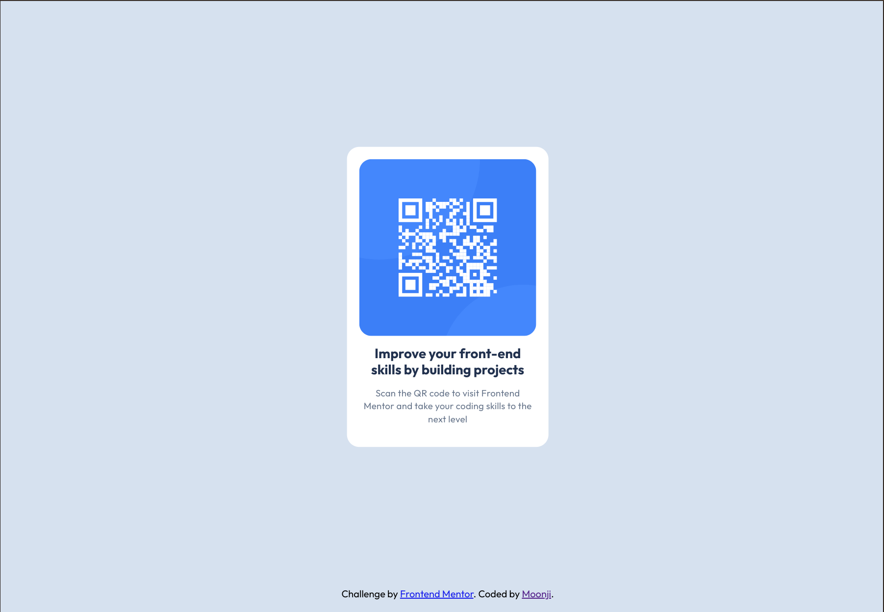

# Frontend Mentor - QR code component solution

This is a solution to the [QR code component challenge on Frontend Mentor](https://www.frontendmentor.io/challenges/qr-code-component-iux_sIO_H). Frontend Mentor challenges help you improve your coding skills by building realistic projects. 

## Table of contents

- [Overview](#overview)
  - [Screenshot](#screenshot)
  - [Links](#links)
- [My process](#my-process)
  - [Built with](#built-with)
  - [What I learned](#what-i-learned)
  - [Continued development](#continued-development)
  - [Useful resources](#useful-resources)
- [Author](#author)
- [Acknowledgments](#acknowledgments)

## Overview

### Screenshot
Frontend Mentor Desktop Design:


My Solution: 


### Links
- My Solution on Netlify - [Moonji](https://frontend-mentor-qr-code-component-moo.netlify.app/)

## My process
1. Add semantic HTML with roles for landmark elements (main and footer in this case) to the text in the index.html file.
2. Copy CSS designs defined by the Figma file into the styles.css file
3. Import fonts and add styling to the body and card component.
4. Make the card responsive to desktop and mobile screens (1440px and 375px)
5. Finish up styling and refine details to make it more accurate to the designs.
6. Update the README.md file.

### Built with

- Semantic HTML5 markup
- CSS custom properties
- Flexbox
- CSS Grid

### What I learned
There are two ways to center content in the body of a web page: 

```css
body {
  display: grid;
  place-items: center;
}
```

and

```css
body {
  display: flex;
  justify-content: center;
  align-items: center;
  width: 100vw;
  min-height: 100svh;
}
```

### Continued development
I want to focus on or perfect using the most efficient methods/strategies for positioning content and arranging them, including images.

### Useful resources

- [MDN Web Docs (ARIA roles)](https://developer.mozilla.org/en-US/docs/Web/Accessibility/ARIA/Roles) - This helped me better understand when to use roles for my semantic HTML elements, especially landmark elements like main, header, section, and footer.

## Author

- Frontend Mentor - [@moonji-spoonji](https://www.frontendmentor.io/profile/yourusername)

## Acknowledgments

Thank you to @MikDra1 and @rkeppler42 for giving me feedback on my first deployment of this project on Netlify! I forgot to use semantic HTML tags and I learned another way to center my page content and make it responsive!
